## Introduction

This project, undertaken as part of the "Learning from Images" course in the Master of Data Science program at Berliner Hochschule für Technik (BHT), leverages the capabilities of pre-trained models to achieve depth-aware object detection. Addressing the challenge of limited datasets that cover both depth and segmentation, and restricted computational resources, we utilize pre-trained models that have been extensively trained on large, diverse datasets. This approach enables the application of these robust models for depth estimation, object detection, and segmentation to enhance the performance of our depth-aware object detection system.

## Models Used

In our project, we employ several pre-trained models for depth estimation, object detection, and segmentation. Here are the models used, along with a brief description and the outputs generated using them.

The below image is chosen as a sample for this documentation:
<p float="left">
  
</p>

## Object Detection and Segmentation Model

- **YOLO-NAS**: [YOLOv8](https://github.com/ultralytics/ultralytics) Chosen for its optimized accuracy and low-latency inference, YOLO-NAS excels in object detection, demonstrating impressive performance on the COCO dataset, Object365 Dataset, and Roboflow100 Dataset. This balance between speed and accuracy makes it an excellent choice for our project.

- **Segment Anything Model (SAM)**: [SAM](https://github.com/facebookresearch/segment-anything) demonstrates superior zero-shot performance and has been trained on a dataset of 11 million images and 1.1 billion masks. Its capability to produce high-quality object masks from various input prompts makes it ideal for our project. The model was chosen for its adaptability in generating masks for specific objects or regions of interest, significantly surpassing previous fully supervised results in many cases.

<p float="left">
  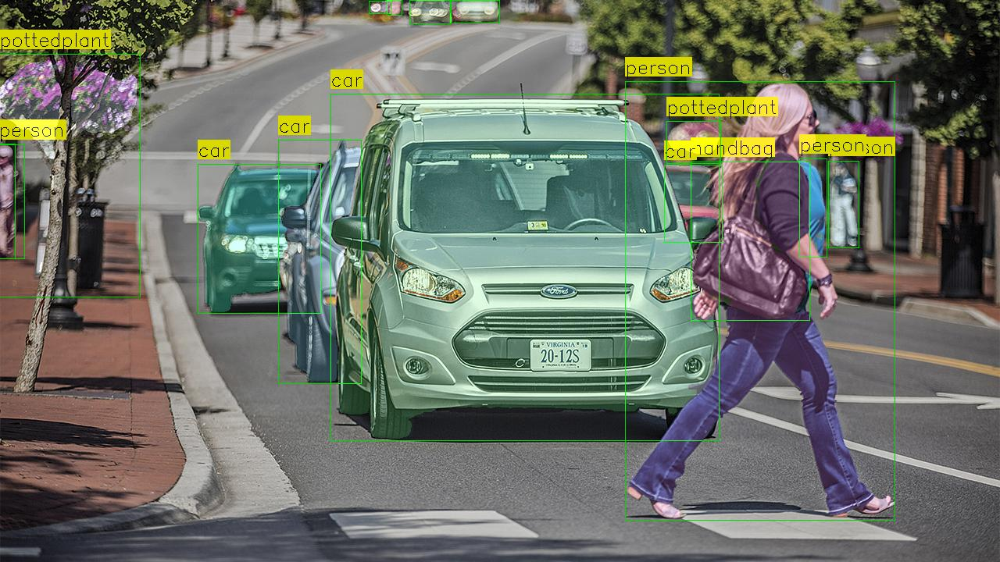
</p>


## Depth Estimation Models

1. **Depth-Anything**: The [Depth-Anything](https://github.com/LiheYoung/Depth-Anything?tab=readme-ov-file) model , trained on a combination of 1.5 million labeled images and over 62 million unlabeled images, is a foundation model designed for robust monocular depth estimation. It allows for relative depth estimation for any given image with fine-tuned capabilities for both in-domain and zero-shot metric depth estimation. This model, particularly noted for its performance enhancement over previous models, provides a versatile approach to depth estimation without requiring specific training on depth-related datasets. We utilized the "vits" encoder among the options ("vits", "vitb", and "vitl") due to its balance between performance and computational efficiency.
<p float="left">
  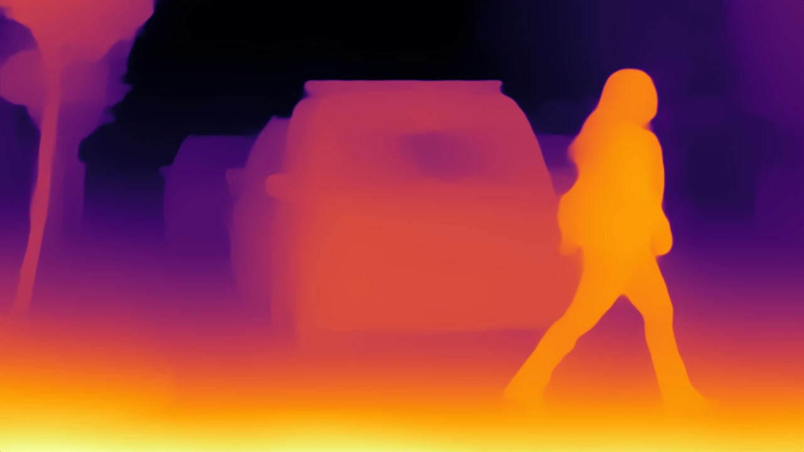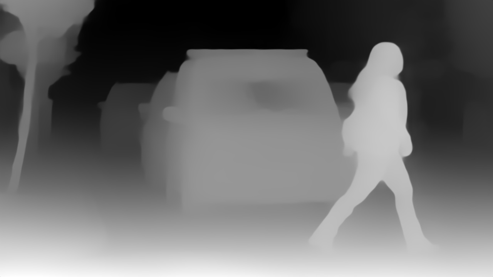 
</p>

2. **MiDaS**: [MiDaS v3.1](https://github.com/isl-org/MiDaS), trained on up to 12 different datasets (including ReDWeb, DIML, Movies, MegaDepth, WSVD, TartanAir, HRWSI, ApolloScape, BlendedMVS, IRS, KITTI, and NYU Depth V2), achieves robust monocular depth estimation across a wide range of scenarios. The model chosen here, DPT_Large, is selected for its robustness among other available models: 'DPT_Hybrid' and 'MiDaS_small'.
<p float="left">
  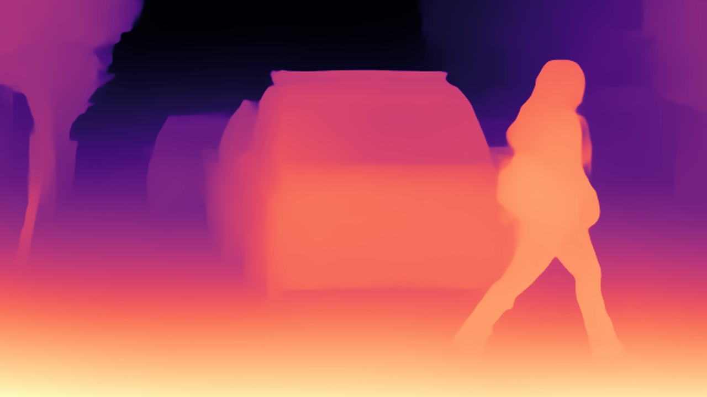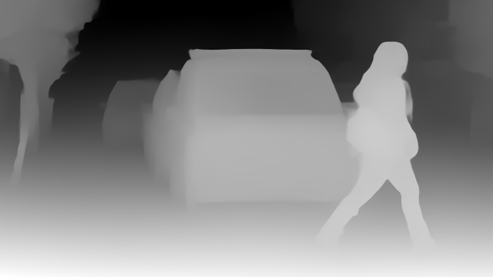 
</p>

3. **Monodepth2**: Developed for self-supervised monocular depth prediction, [Monodepth2](https://github.com/nianticlabs/monodepth2) leverages a novel self-supervision method for depth estimation from single images. Monodepth2 enables effective depth estimation from single images without the need for depth labels, making it a practical addition to our toolkit. The "mono_640x192" model is utilized as the default for our project.

<p float="left">
  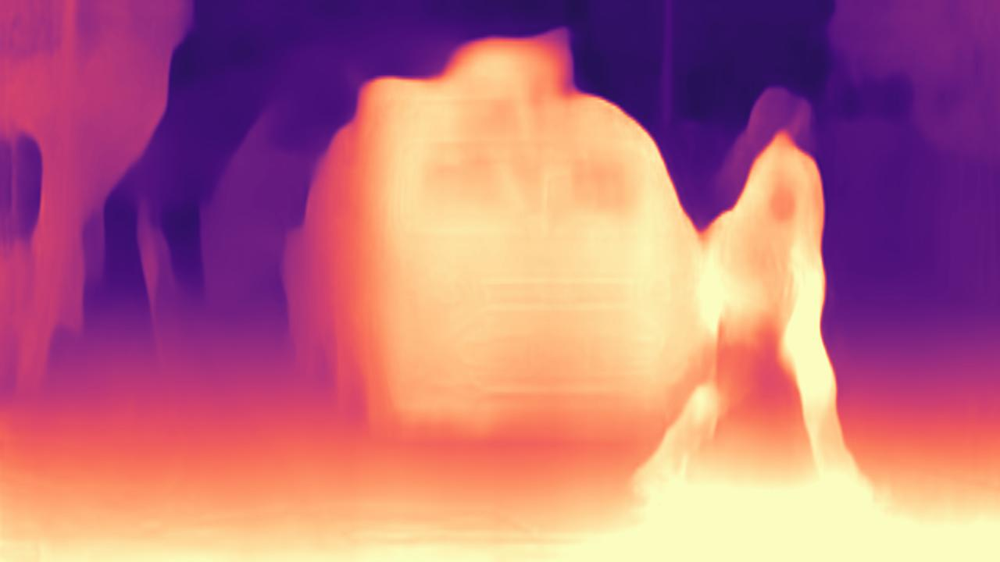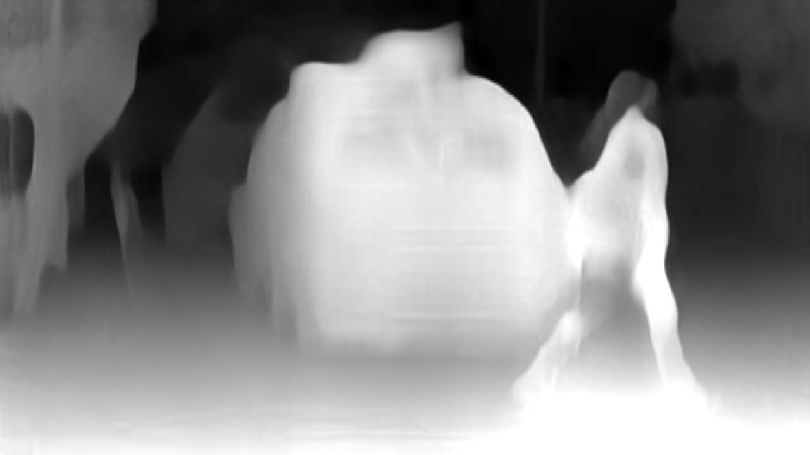 
</p>


### Implementation Details

The core of our project is the integration of various models to develop a depth-aware object detection system. We evaluated depth estimates from Depth-Anything, MiDaS, and Monodepth2 to explore their performance differences in a range of scenarios. For these evaluations, we used both "Color-Mapped Depth Image" and "Raw Depth Image."

Additionally, we have saved a Depth Information Array for future research. This is a numpy array that contains the raw, unscaled depth values as they were directly outputted by the model, before any form of normalization or scaling for visualization purposes. These values represent the model's estimation of the distance from the camera to each point in the scene. We hope to utilize this information in the future to enhance the outputs of our models.

The integration process involves merging the outputs of the object detection and segmentation with the depth information from the selected depth model. This combination allows us to observe how depth information influences the accuracy and robustness of object detection and segmentation across different contexts. However, during this endeavor, we faced challenges. Specifically, when incorporating both color-mapped and raw depth images into our segmentation/object detection model, we noted that the depth images lacked the anticipated detail. This shortfall led to outcomes that fell short of our expectations. Despite our attempts to use the depth information array to enhance our model's performance, we were unable to utilize it as effectively as we had hoped. This experience highlighted the challenges in efficiently leveraging raw depth information to improve our model.

### Depth-Anything
<p float="left">
  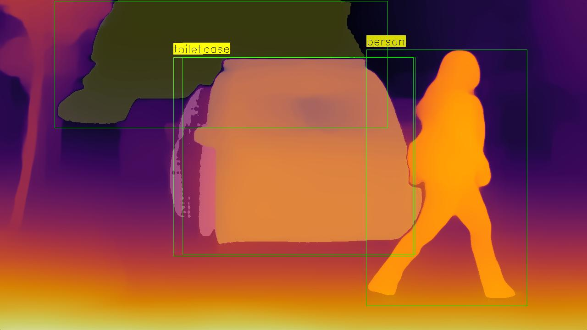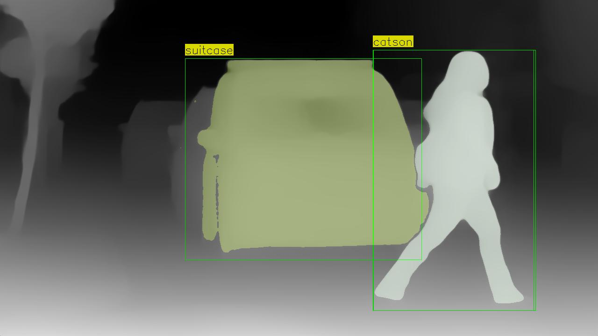 
</p>

### MiDaS
<p float="left">
  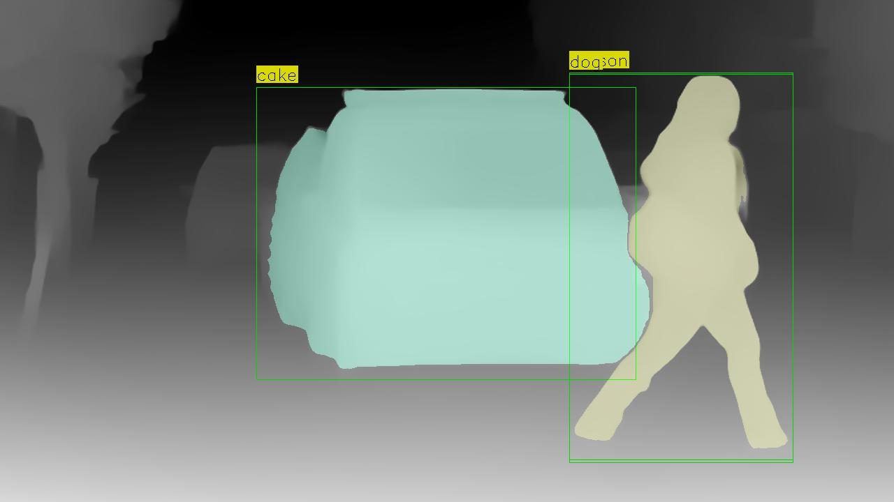 
</p>

### Monodepth2
<p float="left">
  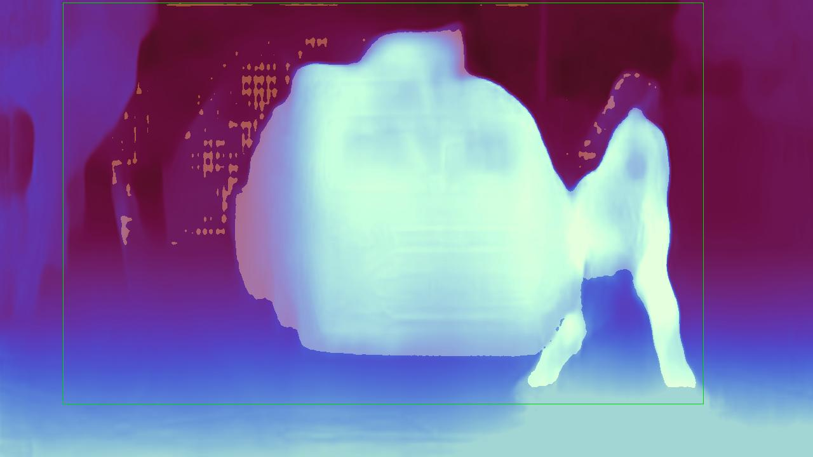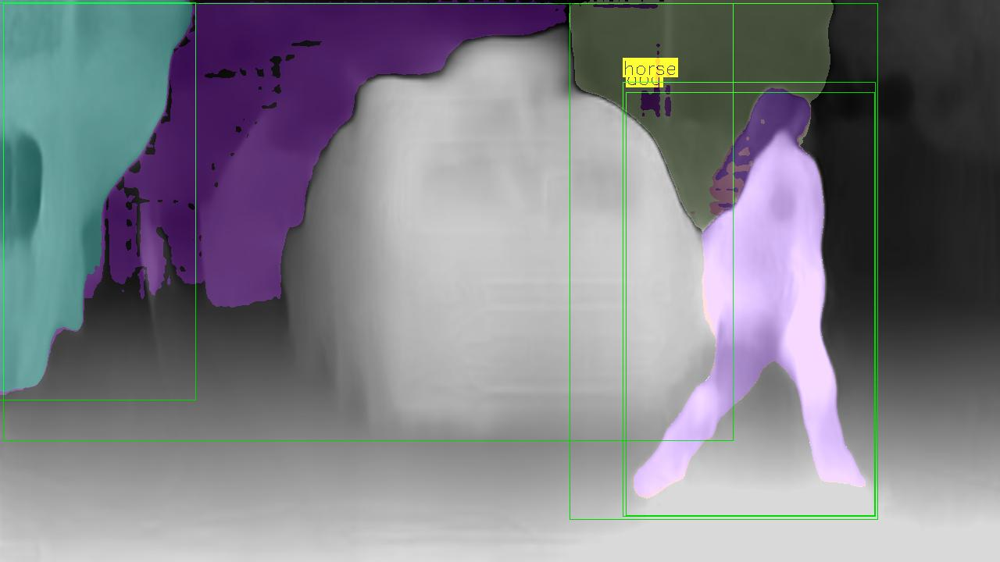 
</p>


### Acknowledgments
All rights are reserved for the authors of the models used in this project. We extend our gratitude to the researchers and developers behind [YOLO-NAS](https://github.com/facebookresearch/segment-anything), [SAM](https://github.com/facebookresearch/segment-anything), [Depth-Anything](https://github.com/facebookresearch/segment-anything), [MiDaS](https://github.com/facebookresearch/segment-anything), and [Monodepth2](https://github.com/facebookresearch/segment-anything) for their contributions to the field of computer vision and deep learning.

## Configuration and Setup
To get started with the project, you'll need to set up your environment and install necessary dependencies. This guide will walk you through the steps using Poetry, a tool for dependency management and packaging in Python.

### Installing Poetry

[Poetry](https://python-poetry.org/) is a tool for dependency management and packaging in Python. To install Poetry, execute the following command in your terminal:

```bash
curl -sSL https://install.python-poetry.org | python3 -
```

This command retrieves and executes the Poetry installation script. Complete guidelines can be find [here](https://python-poetry.org/docs/).

### Setting Up the Project Environment

After installing Poetry, you can set up the project's environment and install its dependencies. Ensure your Python version is `3.10.10` as it is the version used for this project.

1. **Install Dependencies**

   Run the following command in the project directory to install the required dependencies:

   ```bash
   poetry install
   ```

2. **Activate the Environment**

   To activate the Poetry-managed virtual environment, use:

   ```bash
   poetry shell
   ```

### Post-Activation Steps

Due to version conflicts between dependencies, certain libraries need to be installed using pip after activating the environment. Execute the commands below to install these specific libraries:

```bash
pip install ultralytics install super-gradients
```

### Pretrained Model Download

Download the pretrained "Segment Anything Model" and place it in the `data/sam_weights` folder. This model is essential for the project's functionality. Use the command below to download the model:

```bash
wget -c https://dl.fbaipublicfiles.com/segment_anything/sam_vit_h_4b8939.pth -P data/sam_weights/
```

Make sure you have the `wget` tool installed on your system to execute the download command successfully.