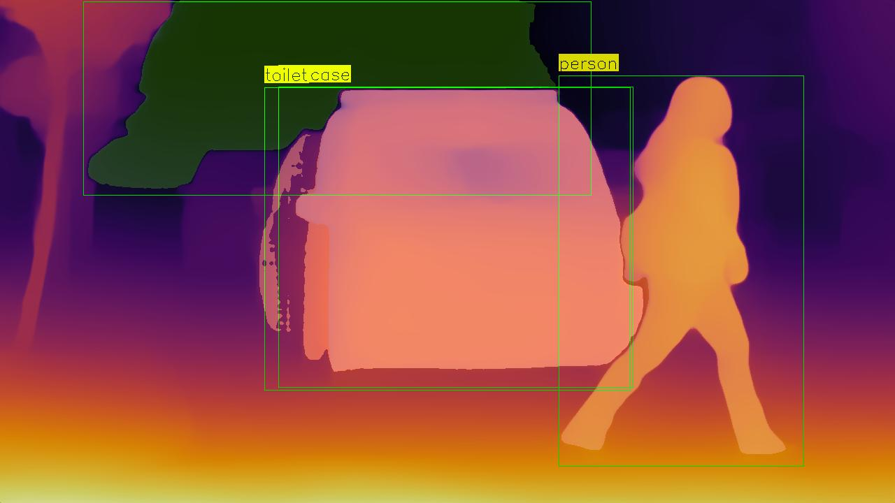

## Introduction

This project, undertaken as part of the "Learning from Images" course in the Master of Data Science program at Berliner Hochschule für Technik ([BHT](https://www.bht-berlin.de/)), leverages the capabilities of pre-trained models to achieve depth-aware object detection. Addressing the challenge of limited datasets that cover both depth and segmentation, and restricted computational resources, we utilize pre-trained models that have been extensively trained on large, diverse datasets. This approach enables the application of these robust models for depth estimation, object detection, and segmentation to enhance the performance of our depth-aware object detection system.


Before diving into the details of our project, please ensure you set up the project environment as detailed [here](#configuration-and-setup). This includes installing dependencies and configuring your system to align with the project requirements. More details about the repository structure also can be found [here](repository-structure)


## Models Used

In our project, we employ several pre-trained models for depth estimation, object detection, and segmentation. Here are the models used, along with a brief description and the outputs generated using them.

The below image is chosen as a sample for this documentation:
<p float="left">
  
</p>

## Object Detection and Segmentation Model

- **YOLO-NAS**: [YOLO-NAS](https://docs.ultralytics.com/models/yolo-nas/) chosen for its optimized accuracy and low-latency inference, YOLO-NAS stands out in the realm of object detection, showcasing impressive performance across various datasets such as COCO, Object365, and Roboflow100. Its remarkable balance between speed and accuracy positions it as an excellent choice for our project. YOLO-NAS is developed by Deci and leverages the capabilities of the "super_gradients" library. This library is an open-source computer vision training tool based on PyTorch, facilitating the efficient implementation of the model.

- **Segment Anything Model (SAM)**: [SAM](https://github.com/facebookresearch/segment-anything), with its state-of-the-art zero-shot performance, leverages a ViT-H image encoder to analyze images with unparalleled depth and accuracy. Trained on the expansive SA-1B dataset, which comprises 11 million images and 1.1 billion masks, SAM demonstrates an exceptional ability to produce high-quality object masks from a wide range of input prompts. This capability makes it exceptionally suited for our project. The model's adaptability in generating precise masks for specific objects or regions of interest marks a significant advancement over previous fully supervised methods, often surpassing them in many scenarios.

<p float="left">
  
</p>

### Quick Start

Run YOLO-NAS and SAM models on your images with the following code snippet:

```python
from da_od.config import class_names, sam_weights, test_img
from da_od.model import SegmentDetection

CLASS_NAME_PATH = class_names / "coco.names.txt"
CHECKPOINT_PATH = sam_weights / "sam_vit_h_4b8939.pth"
image_path = test_img / "img-00007.jpeg"

segment_detector = SegmentDetection(CLASS_NAME_PATH, CHECKPOINT_PATH)
segment_detector.configure_object_detector()
segment_detector.detect_and_segment(image_path)
```

Note: This code can handle direct image inputs from paths and can also accept images generated from other models not stored in a path. Instead of using 'image_path', directly pass the image object to 'detect_and_segment'.

## Depth Estimation Models

1. **Depth-Anything**: The [Depth-Anything](https://github.com/LiheYoung/Depth-Anything?tab=readme-ov-file) model , trained on a combination of 1.5 million labeled images and over 62 million unlabeled images, is a foundation model designed for robust monocular depth estimation. It allows for relative depth estimation for any given image with fine-tuned capabilities for both in-domain and zero-shot metric depth estimation. This model, particularly noted for its performance enhancement over previous models, provides a versatile approach to depth estimation without requiring specific training on depth-related datasets. We utilized the "vits" encoder among the options ("vits", "vitb", and "vitl") due to its balance between performance and computational efficiency.
<p float="left">
   
</p>

### Quick Start
```python
from da_od.model import DepthAnythingEstimator

image_path = test_img / "img-00007.jpeg"
DepthAnything_estimator = DepthAnythingEstimator(image_path, encoder="vits")
DepthAnything_colored, DepthAnything_raw = DepthAnything_estimator.process_image()
```

2. **MiDaS**: [MiDaS v3.1](https://github.com/isl-org/MiDaS), trained on up to 12 different datasets (including ReDWeb, DIML, Movies, MegaDepth, WSVD, TartanAir, HRWSI, ApolloScape, BlendedMVS, IRS, KITTI, and NYU Depth V2), achieves robust monocular depth estimation across a wide range of scenarios. The model chosen here, DPT_Large, is selected for its robustness among other available models: 'DPT_Hybrid' and 'MiDaS_small'.
<p float="left">
   
</p>

### Quick Start
```python
from da_od.model import MiDaSEstimator

image_path = test_img / "img-00007.jpeg"
MiDaS_estimator = MiDaSEstimator(image_path, model_type="DPT_Large")
MiDaS_colored, MiDaS_raw = MiDaS_estimator.process_image()
```

3. **Monodepth2**: Developed for self-supervised monocular depth prediction, [Monodepth2](https://github.com/nianticlabs/monodepth2) leverages a novel self-supervision method for depth estimation from single images. Monodepth2 enables effective depth estimation from single images without the need for depth labels, making it a practical addition to our toolkit. The "mono_640x192" model is utilized as the default for our project.

<p float="left">
   
</p>

### Quick Start
```python
from da_od.model import MonocularDepthEstimator

image_path = test_img / "img-00007.jpeg"
Monocular_estimator = MonocularDepthEstimator(image_path, model_name="mono_640x192")
Monocular_colored, Monocular_raw = Monocular_estimator.process_image()
```

### Implementation Details

The core of our project is the integration of various models to develop a depth-aware object detection system. We evaluated depth estimates from Depth-Anything, MiDaS, and Monodepth2 to explore their performance differences in a range of scenarios. For these evaluations, we used both "[Color-Mapped Depth Image](#color-mapped-depth-images)" and "[Raw Depth Image](#raw-depth-images)."

Additionally, we have saved a Depth Information Array for future research. This is a numpy array that contains the raw, unscaled depth values as they were directly outputted by the model, before any form of normalization or scaling for visualization purposes. These values represent the model's estimation of the distance from the camera to each point in the scene. We hope to utilize this information in the future to enhance the outputs of our models.

The integration process involves merging the outputs of the object detection and segmentation with the depth information from the selected depth model. This combination allows us to observe how depth information influences the accuracy and robustness of object detection and segmentation across different contexts. However, during this endeavor, we faced challenges. Specifically, when incorporating both color-mapped and raw depth images into our segmentation/object detection model, we noted that the depth images lacked the anticipated detail. This shortfall led to outcomes that fell short of our expectations. Despite our attempts to use the depth information array to enhance our model's performance, we were unable to utilize it as effectively as we had hoped. This experience highlighted the challenges in efficiently leveraging raw depth information to improve our model.

### Depth-Anything
<p float="left">
   
</p>

### MiDaS
<p float="left">
   
</p>

### Monodepth2
<p float="left">
   
</p>


## Depth Image Types Explained

Within the scope of our depth estimation models, we utilize two distinct types of depth images to enhance our understanding and processing capabilities:

#### Color-Mapped Depth Images
These images transform raw depth data into a visual color spectrum, where different colors represent varying distances from the camera lens. Typically, warmer colors (e.g., red, orange) denote closer objects, and cooler colors (e.g., blue, green) indicate objects further away. This approach aids in the intuitive interpretation of depth data by human observers, allowing for a more accessible understanding of spatial relationships within the image.

#### Raw Depth Images
Contrary to color-mapped versions, raw depth images store the actual distance values from the camera sensor to points in the scene, measured in units of length (such as meters). These images are not inherently visualizable in a way that conveys depth perception to humans without further processing. However, they hold precise depth information for each pixel, making them invaluable for computational tasks, analyses, and applications that require accurate distance measurements.


## Repository Structure

This repository is organized into several key directories to facilitate easy navigation and understanding of the project's components:

- `da_od/`: This directory is the heart of our project, containing the implementation of object detection, segmentation, and depth estimation functionalities.
- `data/`: Used for storing essential class names, pretrained model weights, and any other data-related assets required by our models.
- `test-imgs/`: Contains sample images that serve as inputs for testing our models' performance and demonstrating their capabilities.
- `output-imgs/`: Stores the output images generated by our models, including both color-mapped and raw depth images, showcasing the results of depth estimation and object segmentation.
- `config/`: Includes configuration files, paths and scripts necessary for setting up and running our project environment, ensuring smooth operation across different setups.

Each directory plays a crucial role in the project's structure, offering a clear and organized way to access code, data, and results pertinent to our depth-aware object detection system.


## Configuration and Setup
To get started with the project, you'll need to set up your environment and install necessary dependencies. This guide will walk you through the steps using Poetry, a tool for dependency management and packaging in Python.

### Installing Poetry

[Poetry](https://python-poetry.org/) is a tool for dependency management and packaging in Python. To install Poetry, execute the following command in your terminal:

```bash
curl -sSL https://install.python-poetry.org | python3 -
```

This command retrieves and executes the Poetry installation script. Complete guidelines can be find [here](https://python-poetry.org/docs/).

### Setting Up the Project Environment 

After installing Poetry, you can set up the project's environment and install its dependencies. Ensure your Python version is `3.10.10` as it is the version used for this project.

1. **Install Dependencies**

   Run the following command in the project directory to install the required dependencies:

   ```bash
   poetry install
   ```

2. **Activate the Environment**

   To activate the Poetry-managed virtual environment, use:

   ```bash
   poetry shell
   ```

### Post-Activation Steps

Due to version conflicts between dependencies, certain libraries need to be installed using pip after activating the environment. Execute the commands below to install these specific libraries:

```bash
pip install ultralytics install super-gradients
```

### Pretrained Model Download

Download the pretrained "Segment Anything Model" and place it in the `data/sam_weights` folder. This model is essential for the project's functionality. Use the command below to download the model:

```bash
wget -c https://dl.fbaipublicfiles.com/segment_anything/sam_vit_h_4b8939.pth -P data/sam_weights/
```

Ensure you have the `wget` tool installed on your system to execute these download commands successfully.


## Acknowledgments
All rights are reserved for the authors of the models used in this project. We extend our gratitude to the researchers and developers behind [YOLO-NAS](https://github.com/facebookresearch/segment-anything), [SAM](https://github.com/facebookresearch/segment-anything), [Depth-Anything](https://github.com/facebookresearch/segment-anything), [MiDaS](https://github.com/facebookresearch/segment-anything), and [Monodepth2](https://github.com/facebookresearch/segment-anything) for their contributions to the field of computer vision and deep learning.
